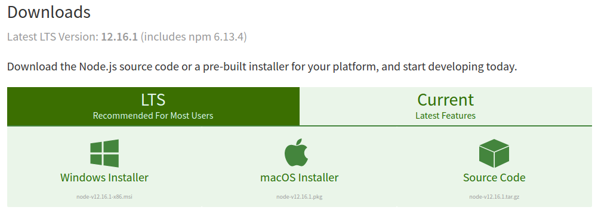

# Work Station Setup

## How to execute commands?

Few steps below requires you to execute some commands, it is not so scary as it looks. 

Just follow these tutorials and you will be fine: 

 - [Windows](https://www.youtube.com/watch?v=MBBWVgE0ewk)
 - [Mac](https://www.youtube.com/watch?v=5XgBd6rjuDQ)
 - [Linux](https://www.youtube.com/watch?v=2FiQSLdnBqA)

## Visual Studio Code

We are going to use a code editor, which is pretty popular amongst developers. Download & install from [code.visualstudio.com](https://code.visualstudio.com), after the installation make sure that everything works fine.

## node & npm

> [Node.js®](https://nodejs.org) is a JavaScript runtime built on Chrome's V8 JavaScript engine. Node.js uses an event-driven, non-blocking I/O model that makes it lightweight and efficient.

To execute code written by you, we are going to use **node**, [download & install **Current** version](https://nodejs.org/en/download)

Detailed instructions (don't pay attention to versions, these videos may be outdated):

 - [Windows 7 / 8](https://www.youtube.com/watch?v=YL0Yk5GBxUE) & [Windows 10](https://www.youtube.com/watch?v=gHuIKptS0Qg)
 - [Mac / Unix](https://www.youtube.com/watch?v=wREima9e6vk)

Since we are going to use superset of [JavaScript](https://developer.mozilla.org/en-US/docs/Web/JavaScript) - [TypeScript](https://www.typescriptlang.org/), install additional package [ts-node](https://www.npmjs.com/package/ts-node).

Simply execute these two commands:

 - `npm install -g ts-node`
 - `npm install -g typescript` 

On Mac / Linux you may get following error - `Error: EACCES: permission denied error`, which means that you cannot install package globally using `-g` flag. To install package globally add `sudo` at the beginning of your command, so that `npm install -g ts-node` becomes `sudo npm install -g ts-node`.

### Verify

 - check node version: `node -v`
 - check npm version: `npm -v`
 - execute code with ts-node: `ts-node -e "console.log('Hello, World!')"`

## Git

We will use Git as our Version Control System. It's like Dropbox for developers. But much better!

Follow [this guide from Github](https://help.github.com/en/articles/set-up-git#setting-up-git) to setup Git.

> What is "version control"? Version control is a system that records changes to a file or set of files over time so that you can recall specific versions later.
> 
> It allows you to revert files back to a previous state, revert the entire project back to a previous state, compare changes over time, see who last modified something that might be causing a problem, who introduced an issue and when, and more. Using a VCS also generally means that if you screw things up or lose files, you can easily recover. In addition, you get all this for very little overhead.
>
> Extract from [Git Pro Book](https://git-scm.com/book/en/v2/Getting-Started-About-Version-Control)

What is **Git**? Git is one of many Version Control Systems available to use, and by far [the most popular](https://insights.stackoverflow.com/survey/2015#tech-sourcecontrol).

What is **Github**? Github is a very popular site where you can publish and share your Git repositories, share and collaborate with other people.

### Verify

 - check Git version: `git --version`